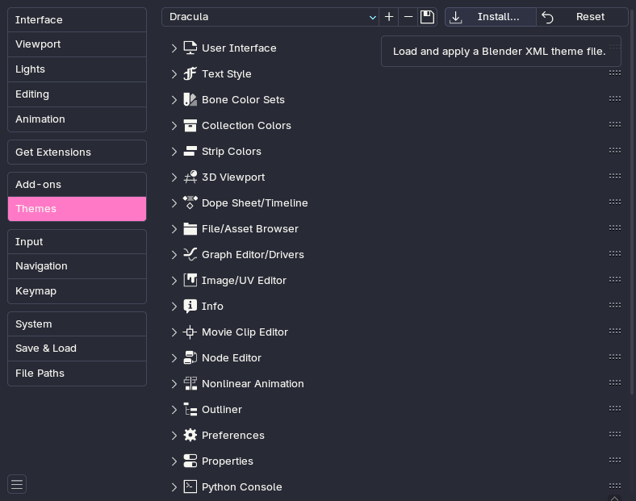

# Dracula for [Blender](https://www.blender.org)

> A dark theme for [Blender](https://www.blender.org).

## Install

<!-- All instructions can be found at [draculatheme.com/blender](https://draculatheme.com/blender). -->

First, download [dracula.xml](dracula.xml)

In blender settings, go to themes and install the theme from the downloaded file

## Team

This theme is maintained by the following person and a bunch of [awesome contributors](https://github.com/dracula/template/blender/contributors).

 |
--- |
[Allie (ChildishGiant)](https://github.com/childishgiant) |

## License

[MIT License](./LICENSE)