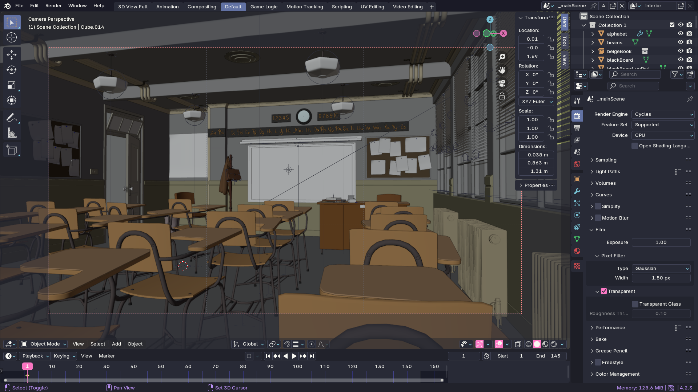

# Dracula for [Blender](https://www.blender.org)

> A dark theme for [Blender](https://www.blender.org).

## Install

All instructions can be found at [draculatheme.com/blender](https://draculatheme.com/blender).

## Team

This theme is maintained by the following person and a bunch of [awesome contributors](https://github.com/dracula/blender/contributors).

|  |
| ------------------------------------------------------------------------------------------------------------------------ |
| [Allie (ChildishGiant)](https://github.com/childishgiant)                                                                |
|  |
| ------------------------------------------------------------------------------------------------------------------------ |
| [foxtrot222](https://github.com/foxtrot222)                                                                |

## Community

- [Twitter](https://twitter.com/draculatheme) - Best for getting updates about themes and new stuff.
- [GitHub](https://github.com/dracula/dracula-theme/discussions) - Best for asking questions and discussing issues.
- [Discord](https://draculatheme.com/discord-invite) - Best for hanging out with the community.

## License

[MIT License](./LICENSE)
